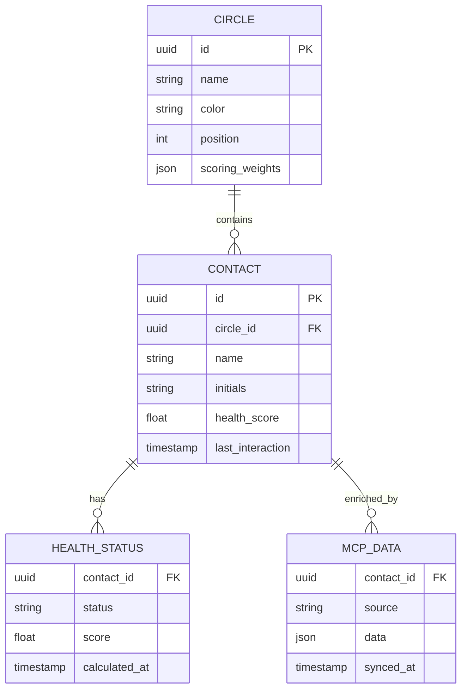

# feat: 3D Solar System Network Interface

> Transform Ping!'s network visualization from buggy 2D/3D hybrid to a smooth, intuitive 3D solar system experience

---

## Overview

Redesign the home screen visualization as a **navigable 3D solar system** where:
- Your network = solar system you navigate spatially
- Rings = orbits (user-defined: family, friends, professional)
- Connections = semi-transparent spheres floating on rings
- Data = visual indicators on each bubble (health glow, MCP data dots)
- AI = built into interaction flow, not separate screens

**Core Principle:** Every interaction must feel buttery smooth. No jank, no unexpected spins, no glitches.

---

## Problem Statement

### Current Issues (from codebase analysis)

1. **Gesture Conflicts**
   - `CircleZoom3D.js:504` - Must reset gesture state to prevent stuck gestures
   - `HomeScreen.js:609-610` - Must call resetTouchState on ALL gesture interruptions
   - No tap/drag disambiguation delay - small movements trigger unwanted rotation

2. **Rotation Problems**
   - Sensitivity too high (small finger movements = big spins)
   - No momentum decay - stops abruptly or spins forever
   - No max rotation speed cap

3. **Visual Depth Issues**
   - Rings float in pure black void - no depth perception
   - No background elements for contrast
   - Health status hard to distinguish at a glance

4. **Performance Concerns**
   - Star count already at 2000 particles in CircleZoom3D
   - No InstancedMesh usage for repeated geometries
   - Label updates throttled but could be optimized further

### User Pain Points

- "Touch controls are often buggy" (founder feedback)
- Spinning unexpectedly when trying to tap
- No clear visual hierarchy when zoomed out
- Difficult to find specific contacts in crowded rings

---

## Proposed Solution

### Architecture: Single 3D Scene with Camera Transitions

```
┌─────────────────────────────────────────────────────────────────┐
│                    SHARED THREE.JS SCENE                        │
│                                                                 │
│  ┌─────────────┐     ┌─────────────┐     ┌─────────────┐       │
│  │   Solar     │     │    Ring     │     │Communication│       │
│  │   System    │────▶│   Focus     │────▶│    View     │       │
│  │   Overview  │     │    View     │     │             │       │
│  └─────────────┘     └─────────────┘     └─────────────┘       │
│        │                   │                    │               │
│        └───────────────────┴────────────────────┘               │
│                     CAMERA MOVEMENTS                            │
│                  (not screen changes)                           │
└─────────────────────────────────────────────────────────────────┘
```

**Benefits:**
- Spatial memory - users know where they are
- Smooth transitions - no jarring screen swaps
- Consistent interaction model throughout

---

## Technical Approach

### Phase 1: Touch System Overhaul

**Goal:** Fix gesture conflicts and make rotation feel natural

**Files to modify:**
- `components/contacts/CircleZoom3D.js`
- `screens/main/HomeScreen.js`

**Implementation:**

```javascript
// New gesture state machine
const GESTURE_STATE = {
  IDLE: 'idle',
  TAP_PENDING: 'tap_pending',  // Within 50ms delay
  DRAGGING: 'dragging',
  PINCHING: 'pinching'
};

// Touch disambiguation
const TAP_DELAY_MS = 50;        // Wait before deciding tap vs drag
const TAP_MAX_DISTANCE = 10;    // px - movement threshold for tap
const DRAG_MIN_DISTANCE = 15;   // px - movement threshold for drag

// Momentum physics
const FRICTION = 0.95;          // Decay per frame
const MAX_VELOCITY = 180;       // degrees/second cap
const SNAP_THRESHOLD = 5;       // degrees/second - snap to rest below this
const SNAP_ANGLE = 15;          // degrees - snap to nearest multiple
```

**Touch Handler Rewrite:**

```javascript
// components/3d/TouchController.js (NEW FILE)

class TouchController {
  constructor(options = {}) {
    this.state = GESTURE_STATE.IDLE;
    this.tapTimer = null;
    this.startPos = { x: 0, y: 0 };
    this.velocity = { x: 0, y: 0 };
    this.lastMoveTime = 0;
    
    this.onTap = options.onTap;
    this.onDragStart = options.onDragStart;
    this.onDrag = options.onDrag;
    this.onDragEnd = options.onDragEnd;
    this.onPinch = options.onPinch;
  }

  handleTouchStart(touches) {
    if (touches.length === 1) {
      this.startPos = { x: touches[0].pageX, y: touches[0].pageY };
      this.state = GESTURE_STATE.TAP_PENDING;
      
      // Start tap detection timer
      this.tapTimer = setTimeout(() => {
        if (this.state === GESTURE_STATE.TAP_PENDING) {
          // Didn't move enough - could still be tap or start of drag
        }
      }, TAP_DELAY_MS);
    } else if (touches.length === 2) {
      this.state = GESTURE_STATE.PINCHING;
      clearTimeout(this.tapTimer);
    }
  }

  handleTouchMove(touches, timestamp) {
    const dt = timestamp - this.lastMoveTime;
    this.lastMoveTime = timestamp;

    if (touches.length === 1 && this.state !== GESTURE_STATE.PINCHING) {
      const dx = touches[0].pageX - this.startPos.x;
      const dy = touches[0].pageY - this.startPos.y;
      const distance = Math.sqrt(dx * dx + dy * dy);

      if (this.state === GESTURE_STATE.TAP_PENDING && distance > TAP_MAX_DISTANCE) {
        // Exceeded tap threshold - this is a drag
        clearTimeout(this.tapTimer);
        this.state = GESTURE_STATE.DRAGGING;
        this.onDragStart?.();
      }

      if (this.state === GESTURE_STATE.DRAGGING) {
        // Calculate velocity for momentum
        this.velocity.x = (dx / dt) * 16; // Normalize to ~60fps
        this.velocity.y = (dy / dt) * 16;
        
        // Cap velocity
        const speed = Math.sqrt(this.velocity.x ** 2 + this.velocity.y ** 2);
        if (speed > MAX_VELOCITY) {
          const scale = MAX_VELOCITY / speed;
          this.velocity.x *= scale;
          this.velocity.y *= scale;
        }

        this.onDrag?.({ dx, dy, velocity: this.velocity });
        this.startPos = { x: touches[0].pageX, y: touches[0].pageY };
      }
    }
  }

  handleTouchEnd(touches) {
    if (this.state === GESTURE_STATE.TAP_PENDING) {
      // Was waiting for tap - this is a tap!
      clearTimeout(this.tapTimer);
      this.onTap?.(this.startPos);
    } else if (this.state === GESTURE_STATE.DRAGGING) {
      // Apply momentum
      this.onDragEnd?.({ velocity: this.velocity });
    }
    
    this.state = GESTURE_STATE.IDLE;
  }

  // Called in animation loop to apply momentum
  update() {
    if (this.state === GESTURE_STATE.IDLE && 
        (Math.abs(this.velocity.x) > 0.01 || Math.abs(this.velocity.y) > 0.01)) {
      // Apply friction
      this.velocity.x *= FRICTION;
      this.velocity.y *= FRICTION;

      // Snap to rest when slow enough
      const speed = Math.sqrt(this.velocity.x ** 2 + this.velocity.y ** 2);
      if (speed < SNAP_THRESHOLD) {
        this.velocity = { x: 0, y: 0 };
        // TODO: Snap to nearest SNAP_ANGLE
      }

      return this.velocity;
    }
    return null;
  }
}
```

### Phase 2: Background Depth System

**Goal:** Add visual grounding with layered background

**New file:** `components/3d/StarField.js`

```javascript
// Layered background for depth perception

export function createBackgroundLayers(scene) {
  // Layer 1: Distant star field (very slow parallax)
  const distantStars = createStarLayer({
    count: 500,
    size: 0.5,
    opacity: 0.1,
    spread: 500,
    color: 0xffffff
  });
  
  // Layer 2: Nebula wisps (soft gradients)
  const nebula = createNebulaLayer({
    opacity: 0.05,
    colors: [0x4a0080, 0x000080, 0x004040]
  });
  
  // Layer 3: Closer stars (subtle twinkle)
  const closeStars = createStarLayer({
    count: 200,
    size: 1.0,
    opacity: 0.2,
    spread: 200,
    twinkle: true
  });

  scene.add(distantStars);
  scene.add(nebula);
  scene.add(closeStars);
  
  return { distantStars, nebula, closeStars };
}

function createStarLayer({ count, size, opacity, spread, twinkle = false }) {
  const positions = new Float32Array(count * 3);
  
  for (let i = 0; i < count; i++) {
    // Distribute in sphere
    const theta = Math.random() * Math.PI * 2;
    const phi = Math.acos(2 * Math.random() - 1);
    const r = spread * (0.5 + Math.random() * 0.5);
    
    positions[i * 3] = r * Math.sin(phi) * Math.cos(theta);
    positions[i * 3 + 1] = r * Math.sin(phi) * Math.sin(theta);
    positions[i * 3 + 2] = r * Math.cos(phi);
  }
  
  const geometry = new THREE.BufferGeometry();
  geometry.setAttribute('position', new THREE.BufferAttribute(positions, 3));
  
  const material = new THREE.PointsMaterial({
    size,
    sizeAttenuation: true,
    transparent: true,
    opacity,
    blending: THREE.AdditiveBlending
  });
  
  return new THREE.Points(geometry, material);
}
```

### Phase 3: Multi-Ring Solar System View

**Goal:** Show all rings in one navigable view

**New file:** `components/3d/SolarSystemView.js`

```javascript
// Main solar system visualization

const RING_CONFIG = {
  baseRadius: 3,       // Innermost ring
  radiusStep: 2.5,     // Distance between rings
  maxRings: 6,
  maxContactsPerRing: 12,  // Visual limit
  ringOpacity: 0.3,
  contactRadius: 0.4
};

export function SolarSystemView({
  circles,           // Array of { id, name, color, contacts }
  healthMap,         // { contactId: { score, status } }
  onContactTap,
  onRingTap,
  onGoalSet,         // For AI goal planning
}) {
  const sceneRef = useRef(null);
  const cameraRef = useRef(null);
  const touchController = useRef(null);
  const instancedMeshRef = useRef(null);
  
  // Initialize scene
  useEffect(() => {
    // ... scene setup with background layers
  }, []);

  // Create instanced mesh for all contact bubbles
  useEffect(() => {
    const totalContacts = circles.reduce((sum, c) => 
      sum + Math.min(c.contacts.length, RING_CONFIG.maxContactsPerRing), 0);
    
    const geometry = new THREE.SphereGeometry(
      RING_CONFIG.contactRadius, 
      16,  // Low poly for mobile
      16
    );
    
    const material = new THREE.MeshStandardMaterial({
      transparent: true,
      opacity: 0.7,
      metalness: 0.3,
      roughness: 0.7
    });
    
    const instancedMesh = new THREE.InstancedMesh(
      geometry, 
      material, 
      totalContacts
    );
    
    // Position each instance
    const matrix = new THREE.Matrix4();
    const color = new THREE.Color();
    let instanceIndex = 0;
    
    circles.forEach((circle, ringIndex) => {
      const radius = RING_CONFIG.baseRadius + ringIndex * RING_CONFIG.radiusStep;
      const contacts = circle.contacts.slice(0, RING_CONFIG.maxContactsPerRing);
      
      contacts.forEach((contact, i) => {
        const angle = (i / contacts.length) * Math.PI * 2;
        const x = Math.cos(angle) * radius;
        const z = Math.sin(angle) * radius;
        
        matrix.setPosition(x, 0, z);
        instancedMesh.setMatrixAt(instanceIndex, matrix);
        
        // Color based on health
        const health = healthMap[contact.id];
        color.set(getHealthColor(health?.status || 'unknown'));
        instancedMesh.setColorAt(instanceIndex, color);
        
        instanceIndex++;
      });
    });
    
    instancedMesh.instanceMatrix.needsUpdate = true;
    instancedMesh.instanceColor.needsUpdate = true;
    instancedMeshRef.current = instancedMesh;
    sceneRef.current.add(instancedMesh);
    
    return () => {
      geometry.dispose();
      material.dispose();
    };
  }, [circles, healthMap]);

  // Render rings as transparent torus shapes
  // ...
}
```

### Phase 4: View Transitions

**Goal:** Smooth camera movements between views

```javascript
// components/3d/CameraController.js

const TRANSITIONS = {
  OVERVIEW_TO_RING: {
    duration: 400,
    easing: easeOutCubic,
  },
  RING_TO_CONTACT: {
    duration: 500,
    easing: easeInOutCubic,
  }
};

export function animateCameraTo(camera, target, options) {
  const { duration, easing } = options;
  const startPos = camera.position.clone();
  const startLookAt = new THREE.Vector3(); // Get current lookAt
  
  let startTime = null;
  
  function animate(timestamp) {
    if (!startTime) startTime = timestamp;
    const elapsed = timestamp - startTime;
    const progress = Math.min(elapsed / duration, 1);
    const easedProgress = easing(progress);
    
    // Interpolate position
    camera.position.lerpVectors(startPos, target.position, easedProgress);
    
    // Interpolate lookAt
    const currentLookAt = new THREE.Vector3().lerpVectors(
      startLookAt, 
      target.lookAt, 
      easedProgress
    );
    camera.lookAt(currentLookAt);
    
    if (progress < 1) {
      requestAnimationFrame(animate);
    } else {
      options.onComplete?.();
    }
  }
  
  requestAnimationFrame(animate);
}

function easeOutCubic(t) {
  return 1 - Math.pow(1 - t, 3);
}

function easeInOutCubic(t) {
  return t < 0.5 
    ? 4 * t * t * t 
    : 1 - Math.pow(-2 * t + 2, 3) / 2;
}
```

### Phase 5: AI Integration (Built-In, Not Separate Screen)

**Goal:** AI suggestions appear contextually, not in separate screens

```javascript
// In Communication View - AI suggestions are inline

function CommunicationOverlay({ contact, onSuggestionUse }) {
  const [suggestion, setSuggestion] = useState(null);
  const [loading, setLoading] = useState(true);
  
  useEffect(() => {
    // Fetch AI suggestion when contact is focused
    fetchPingQuestion(contact.id).then(setSuggestion);
  }, [contact.id]);

  return (
    <View style={styles.overlay}>
      {/* Contact info header */}
      <ContactHeader contact={contact} />
      
      {/* AI Suggestion Card - INLINE, not modal */}
      <View style={styles.suggestionCard}>
        <Text style={styles.suggestionLabel}>💡 Ping AI Suggests:</Text>
        <Text style={styles.suggestionText}>{suggestion?.text}</Text>
        <View style={styles.suggestionActions}>
          <TouchableOpacity onPress={() => onSuggestionUse(suggestion)}>
            <Text>Use this →</Text>
          </TouchableOpacity>
          <TouchableOpacity onPress={regenerate}>
            <Text>🔄 Regenerate</Text>
          </TouchableOpacity>
        </View>
      </View>
      
      {/* Communication buttons */}
      <CommunicationButtons contact={contact} />
    </View>
  );
}
```

---

## Acceptance Criteria

### Functional Requirements

- [ ] **F1:** Solar system view shows all rings with contact bubbles
- [ ] **F2:** Single tap on bubble selects contact, shows quick info
- [ ] **F3:** Double tap on bubble transitions to communication view
- [ ] **F4:** Drag rotates entire system with momentum
- [ ] **F5:** Pinch zooms in/out smoothly
- [ ] **F6:** Long press shows quick action menu
- [ ] **F7:** Tap on ring highlights that ring's contacts
- [ ] **F8:** AI suggestions appear in communication view (not separate screen)
- [ ] **F9:** Background has visible depth (stars, subtle gradients)
- [ ] **F10:** Health status clearly visible via glow intensity/color

### Non-Functional Requirements

- [ ] **NF1:** 60fps on iPhone 12 and newer with 100 contacts
- [ ] **NF2:** Touch response < 16ms (one frame)
- [ ] **NF3:** Transition animations complete in < 500ms
- [ ] **NF4:** No gesture conflicts (tap never triggers rotation)
- [ ] **NF5:** Memory usage < 150MB for 3D scene
- [ ] **NF6:** Battery drain < 5% per hour of active use

### Quality Gates

- [ ] Test on physical iPhone (not simulator)
- [ ] Test with 10, 50, 100, 200 contacts
- [ ] Test all gesture combinations (tap, drag, pinch, long-press)
- [ ] Test transitions from every view to every other view
- [ ] Profile with Xcode Instruments for memory leaks
- [ ] Verify accessibility with VoiceOver

---

## Implementation Phases

### Phase 1: Touch System (3-4 days)
**Files:**
- `components/3d/TouchController.js` (NEW)
- `components/contacts/CircleZoom3D.js` (MODIFY)
- `screens/main/HomeScreen.js` (MODIFY)

**Deliverables:**
- New TouchController class with state machine
- 50ms tap/drag disambiguation
- Velocity-based momentum with friction
- Max rotation speed cap
- Snap-to-rest behavior

### Phase 2: Background & Depth (2 days)
**Files:**
- `components/3d/StarField.js` (NEW)
- `components/3d/BackgroundLayers.js` (NEW)

**Deliverables:**
- Layered star field (distant + close)
- Subtle nebula gradients
- Parallax effect on camera movement
- Performance-optimized (< 1000 particles total)

### Phase 3: Solar System View (4-5 days)
**Files:**
- `components/3d/SolarSystemView.js` (NEW)
- `components/3d/RingRenderer.js` (NEW)
- `components/3d/ContactBubble.js` (NEW)

**Deliverables:**
- InstancedMesh for all contact bubbles
- Ring geometry with configurable colors
- Health-based glow materials
- Content limiting (max 12 per ring visible)
- "+N more" indicators

### Phase 4: View Transitions (2-3 days)
**Files:**
- `components/3d/CameraController.js` (NEW)
- `components/3d/ViewTransitions.js` (NEW)

**Deliverables:**
- Smooth camera animations between views
- Easing functions (ease-out-cubic, ease-in-out-cubic)
- Fade effects for non-focused elements
- Back navigation with reverse animation

### Phase 5: AI Integration (3-4 days)
**Files:**
- `components/communication/CommunicationOverlay.js` (NEW)
- `components/communication/AISuggestionCard.js` (NEW)
- `utils/api/pingAI.js` (NEW)

**Deliverables:**
- Inline AI suggestion display
- Integration with existing Supabase edge functions
- Regenerate functionality
- "Use this" action (copy to message input)

### Phase 6: Polish & Optimization (2-3 days)
**Files:**
- All 3D components

**Deliverables:**
- Performance profiling and optimization
- Memory leak fixes
- Edge case handling
- Accessibility improvements

---

## Risk Analysis & Mitigation

| Risk | Impact | Likelihood | Mitigation |
|------|--------|------------|------------|
| Performance issues on older devices | High | Medium | LOD system, reduce particle count, test early |
| Gesture conflicts persist | High | Low | State machine approach, extensive testing |
| Memory leaks in 3D scene | Medium | Medium | Strict disposal patterns, profiling |
| AI suggestions feel intrusive | Medium | Low | Subtle UI, easy dismiss, user control |
| Transition animations feel jarring | Medium | Low | Fine-tune easing curves, user testing |

---

## Dependencies & Prerequisites

### Required Before Starting
- [ ] Design mockups approved (via Stitch or similar)
- [ ] Existing CircleZoom3D code reviewed
- [ ] Performance baseline established (current fps/memory)

### External Dependencies
- `expo-gl: ~16.0.9` (already installed)
- `expo-three: ^8.0.0` (already installed)
- `three: ^0.166.1` (already installed)
- Supabase edge functions for AI (already deployed)

---

## Success Metrics

| Metric | Current | Target |
|--------|---------|--------|
| Touch gesture accuracy | Unknown (buggy) | 99% correct intent |
| Frame rate during interaction | ~45fps | 60fps constant |
| Time to find specific contact | ~10s | < 3s |
| User-reported "buggy" issues | Frequent | Zero |
| App Store rating related to UX | N/A | 4.5+ stars |

---

## References

### Internal Files
- `components/contacts/CircleZoom3D.js` - Existing 3D ring view (869 lines)
- `components/contacts/PlanetZoom3D.js` - Existing contact view (1095 lines)
- `screens/main/HomeScreen.js` - Current home screen (2400 lines)
- `docs/vision/3D_DESIGN_SPEC.md` - Design specification
- `docs/vision/WEB_VS_IOS_COMPARISON.md` - Web app analysis

### External Documentation
- expo-gl: https://docs.expo.dev/versions/latest/sdk/gl-view/
- expo-three: https://github.com/expo/expo-three
- Three.js InstancedMesh: https://threejs.org/docs/#api/en/objects/InstancedMesh
- react-native-gesture-handler: https://docs.swmansion.com/react-native-gesture-handler/
- R3F Performance Guide: https://r3f.docs.pmnd.rs/advanced/scaling-performance

### Research Findings
- 50ms tap/drag delay recommended for disambiguation
- 0.95 friction factor for natural momentum decay
- InstancedMesh provides 10-100x performance for 50+ objects
- Max 200 draw calls for mobile 60fps
- OrbitControls doesn't work in RN - custom implementation required

---

## ERD: New Data Structures



---

## Appendix: Pseudo-code File Structure

```
components/
  3d/
    TouchController.js      # Gesture state machine
    SolarSystemView.js      # Main 3D visualization
    RingRenderer.js         # Ring geometry + materials
    ContactBubble.js        # Contact sphere rendering
    CameraController.js     # Camera animations
    ViewTransitions.js      # Transition effects
    StarField.js            # Background particles
    BackgroundLayers.js     # Depth layers
  
  communication/
    CommunicationOverlay.js # Full-screen contact view
    AISuggestionCard.js     # Inline AI suggestions
    MessageComposer.js      # Video/voice/text input

utils/
  api/
    pingAI.js               # AI suggestion fetching
  3d/
    geometryPool.js         # Reusable geometries
    materialCache.js        # Shared materials
```
