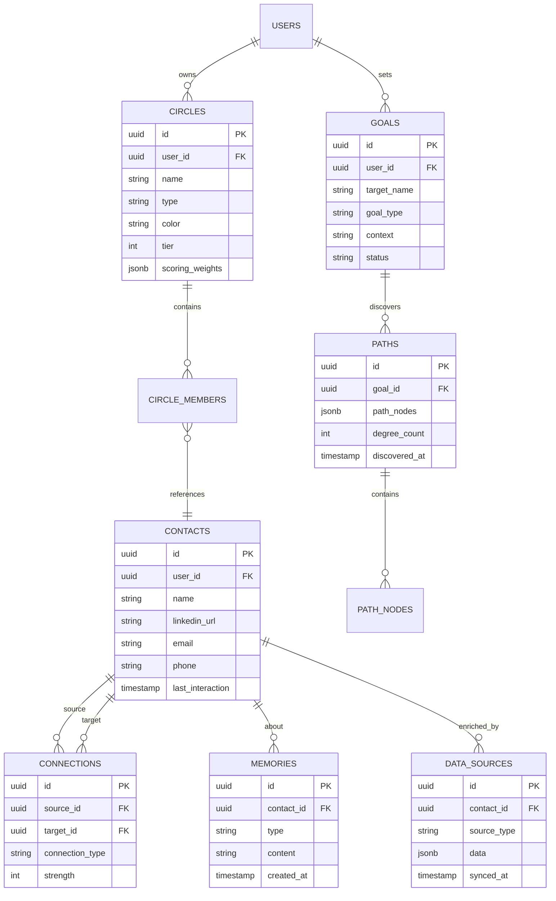

# feat: Ping MVP - 3D Solar System Interface with People Search Integration

> Transform Ping into an immersive 3D network visualization with AI-powered people discovery and six degrees of connection path finding.

---

## Overview

This plan covers the complete MVP build-out for Ping, integrating:
1. **3D Solar System Interface** - Smooth touch controls, camera transitions, depth backgrounds
2. **Web App Feature Ports** - AI question generation, events, OAuth import
3. **People Search** - Exa AI integration for discovering connections
4. **Goal Planning** - Six degrees path finding with animated 3D visualization
5. **MCP Data Integration** - LinkedIn, Calendar, Twitter data orbs

**Estimated Timeline:** 4-6 weeks with parallel agent execution

---

## Research Findings Summary

### Codebase Analysis (from repo-research-analyst)

| Component | File | Key Findings |
|-----------|------|--------------|
| 3D Scene Setup | `CircleZoom3D.js:77-100` | Uses expo-gl + expo-three, PerspectiveCamera |
| Orbit Animation | `CircleZoom3D.js:269-330` | requestAnimationFrame loop, smooth rotation interpolation |
| Touch Handling | `CircleZoom3D.js:378-475` | Manual gesture state, raycast for tap detection |
| Health Colors | `healthScoring.js:44-53` | Status → color mapping (healthy=#4FFFB0) |
| Gesture Reset | `HomeScreen.js:575-582` | `resetTouchState()` pattern for conflict prevention |
| Label Projection | `CircleZoom3D.js:339-365` | 3D→2D coordinate projection for React Native overlays |

### Best Practices (from best-practices-researcher)

| Area | Recommendation | Source |
|------|----------------|--------|
| Many Objects | InstancedMesh for 50+ similar objects | three.js docs |
| Touch Disambiguation | 50ms delay before deciding tap vs drag | R3F patterns |
| Momentum | withDecay() with 0.998 deceleration | Reanimated docs |
| Camera Controls | Manual implementation (OrbitControls breaks in RN) | expo-three issues |
| People Search | `category: "people"` parameter | Exa docs (Dec 2025) |
| Graph Traversal | Recursive CTE in PostgreSQL for BFS | pgRouting docs |

### Framework Documentation (from framework-docs-researcher)

| Package | Version | Key API |
|---------|---------|---------|
| expo-gl | ~16.0.9 | `GLView.onContextCreate`, `gl.endFrameEXP()` |
| expo-three | ^8.0.0 | `Renderer`, `ExpoTHREE.loadAsync()` |
| three.js | ^0.166.1 | `InstancedMesh`, `Raycaster`, `BufferGeometry` |
| exa-js | latest | `search()`, `searchAndContents()`, `findSimilar()` |

---

## Phase 1: Foundation (Days 1-3)

### 1.1 Touch System Overhaul

**Files to create/modify:**
- `components/3d/TouchController.js` (NEW)
- `components/contacts/CircleZoom3D.js` (MODIFY)
- `screens/main/HomeScreen.js` (MODIFY)

**Implementation:**

```javascript
// components/3d/TouchController.js
const GESTURE_STATE = {
  IDLE: 'idle',
  TAP_PENDING: 'tap_pending',
  DRAGGING: 'dragging',
  PINCHING: 'pinching'
};

const TAP_DELAY_MS = 50;
const TAP_MAX_DISTANCE = 10;
const FRICTION = 0.95;
const MAX_VELOCITY = 180;

export class TouchController {
  constructor(options) { /* ... */ }
  handleTouchStart(touches) { /* ... */ }
  handleTouchMove(touches, timestamp) { /* ... */ }
  handleTouchEnd(touches) { /* ... */ }
  update() { /* Apply momentum decay */ }
}
```

**Acceptance Criteria:**
- [ ] Tap detected within 50ms without movement
- [ ] Drag detected after 50ms OR >10px movement
- [ ] Momentum applies on drag end with 0.95 friction
- [ ] Velocity capped at 180 degrees/second
- [ ] No gesture conflicts (tap never triggers rotation)

### 1.2 Background Depth System

**Files to create:**
- `components/3d/StarField.js` (NEW)
- `components/3d/BackgroundLayers.js` (NEW)

**Implementation:**

```javascript
// components/3d/StarField.js
export function createBackgroundLayers(scene) {
  // Layer 1: Distant stars (500 particles, 5-10% opacity, slow parallax)
  // Layer 2: Nebula wisps (soft gradients, 3-5% opacity)
  // Layer 3: Close stars (200 particles, 15-20% opacity, twinkle)
}
```

**Acceptance Criteria:**
- [ ] Three-layer star field renders
- [ ] Subtle parallax on camera movement
- [ ] Total particle count < 1000 for performance
- [ ] Nebula gradients visible but not distracting

### 1.3 Environment Setup (Exa, Linkup)

**Files to create:**
- `lib/exa.js` (NEW)
- `lib/linkup.js` (NEW)
- `supabase/functions/people-search/index.ts` (NEW)

**Implementation:**

```typescript
// supabase/functions/people-search/index.ts
serve(async (req) => {
  const exaApiKey = Deno.env.get('EXA_API_KEY');
  const { query, category = 'people' } = await req.json();
  
  const response = await fetch('https://api.exa.ai/search', {
    method: 'POST',
    headers: { 'x-api-key': exaApiKey, 'Content-Type': 'application/json' },
    body: JSON.stringify({ query, category, numResults: 20, text: true })
  });
  
  return new Response(JSON.stringify(await response.json()));
});
```

**Acceptance Criteria:**
- [ ] `EXA_API_KEY` and `LINKUP_API_KEY` in Supabase secrets
- [ ] Edge function deploys and responds
- [ ] People search returns results with `category: "people"`
- [ ] Rate limiting with exponential backoff

---

## Phase 2: Web App Feature Ports (Days 4-7)

### 2.1 AI Question Generation

**Port from web:** `supabase/functions/generate_ping_question`

**Files to create:**
- `supabase/functions/generate-ping-question/index.ts` (NEW)
- `utils/api/pingAI.js` (NEW)
- `components/communication/AISuggestionCard.js` (NEW)

**Implementation:**

```javascript
// utils/api/pingAI.js
export async function fetchPingQuestion(contactId, context) {
  const { data, error } = await supabase.functions.invoke('generate-ping-question', {
    body: { contactId, context }
  });
  return data?.suggestion;
}
```

**Acceptance Criteria:**
- [ ] AI generates contextual conversation starters
- [ ] Suggestions reference shared interests (from MCP data)
- [ ] "Use this" copies to message input
- [ ] "Regenerate" fetches new suggestion

### 2.2 Events Integration (Optional)

**Port from web:** Eventbrite API integration

**Files to create:**
- `utils/api/events.js` (NEW)
- `supabase/functions/fetch-events/index.ts` (NEW)

**Acceptance Criteria:**
- [ ] Fetch events for a contact's area
- [ ] Show shared upcoming events
- [ ] "Suggest event" as conversation starter

### 2.3 LinkedIn/Google OAuth Import

**Port from web:** OAuth flows for contact enrichment

**Files to create:**
- `screens/settings/ImportLinkedInScreen.js` (NEW)
- `utils/oauth/linkedIn.js` (NEW)

**Acceptance Criteria:**
- [ ] LinkedIn OAuth flow completes
- [ ] Imported connections sync to Supabase
- [ ] Profile photos imported as textures

---

## Phase 3: 3D Solar System Views (Days 8-14)

### 3.1 Solar System Overview

**Files to create:**
- `components/3d/SolarSystemView.js` (NEW)
- `components/3d/RingRenderer.js` (NEW)
- `components/3d/ContactBubble.js` (NEW)

**Implementation:**

```javascript
// components/3d/SolarSystemView.js
const RING_CONFIG = {
  baseRadius: 3,
  radiusStep: 2.5,
  maxRings: 6,
  maxContactsPerRing: 12,
  contactRadius: 0.4
};

export function SolarSystemView({ circles, healthMap, onContactTap, onRingTap }) {
  // Use InstancedMesh for all contact spheres
  // Ring geometry with configurable colors
  // Health-based glow materials
}
```

**Acceptance Criteria:**
- [ ] All rings render with InstancedMesh
- [ ] Health status shown via glow color
- [ ] "+N more" indicator for crowded rings
- [ ] Tap ring to focus, tap contact to select

### 3.2 Communication View (3D Person Sphere)

**Files to create:**
- `components/3d/PersonSphereView.js` (NEW)
- `components/3d/DataOrb.js` (NEW)

**Implementation:**

```javascript
// components/3d/PersonSphereView.js
// Person's photo texture-mapped onto sphere
// Data orbs orbit (LinkedIn, Calendar, Twitter)
// Health aura at base
// Glass-morphism floating UI panels
```

**Visual Requirements (for Stitch/AI mockup generation):**
- Person sphere floating in 3D space, slowly rotating (5-10s per revolution)
- Photo mapped as texture on sphere surface
- Small data orbs orbit around sphere (MCP sources)
- Stars visible through/around sphere
- NOT a 2D card - must render in Three.js

**Acceptance Criteria:**
- [ ] Photo texture loads and maps to sphere
- [ ] Data orbs orbit at different speeds/angles
- [ ] Tap orb to see data source details
- [ ] Health glow pulses for attention states

### 3.3 Camera Transitions

**Files to create:**
- `components/3d/CameraController.js` (NEW)
- `components/3d/ViewTransitions.js` (NEW)

**Implementation:**

```javascript
// components/3d/CameraController.js
export function animateCameraTo(camera, target, options) {
  const { duration = 400, easing = easeOutCubic } = options;
  // Interpolate position and lookAt
  // Call onComplete when done
}
```

**Transition Map:**
| From | To | Animation | Duration |
|------|-----|-----------|----------|
| Overview | Ring Focus | Camera moves toward ring | 400ms |
| Ring Focus | Contact | Camera flies into bubble | 500ms |
| Contact | Ring | Camera pulls back | 400ms |
| Any | Overview | Camera rises to top-down | 500ms |

**Acceptance Criteria:**
- [ ] Transitions use easing (ease-out-cubic, ease-in-out-cubic)
- [ ] No jarring screen changes - only camera movement
- [ ] Non-focused elements fade/blur
- [ ] Back navigation reverses animation

---

## Phase 4: Goal Planning & Path Discovery (Days 15-19)

### 4.1 Path Finding Backend

**Files to create:**
- `utils/api/pathFinding.js` (NEW)
- `supabase/functions/find-path/index.ts` (NEW)

**Database Schema:**

```sql
-- connections table for graph
CREATE TABLE connections (
  id UUID PRIMARY KEY DEFAULT gen_random_uuid(),
  source_id UUID REFERENCES contacts(id),
  target_id UUID REFERENCES contacts(id),
  connection_type TEXT DEFAULT 'knows',
  strength INTEGER DEFAULT 1,
  UNIQUE(source_id, target_id)
);

-- Index for BFS
CREATE INDEX idx_connections_source ON connections(source_id);
CREATE INDEX idx_connections_target ON connections(target_id);
```

**BFS Implementation:**

```sql
-- Recursive CTE for shortest path
WITH RECURSIVE paths AS (
  SELECT source_id, target_id, ARRAY[source_id, target_id] AS path, 1 AS depth
  FROM connections WHERE source_id = :start_id
  UNION ALL
  SELECT p.source_id, c.target_id, p.path || c.target_id, p.depth + 1
  FROM paths p JOIN connections c ON c.source_id = p.target_id
  WHERE NOT c.target_id = ANY(p.path) AND p.depth < 6
)
SELECT path, depth FROM paths WHERE target_id = :end_id ORDER BY depth LIMIT 1;
```

**Acceptance Criteria:**
- [ ] BFS finds shortest path up to 6 degrees
- [ ] Exa search discovers intermediary connections
- [ ] Paths cached in Supabase for fast lookup
- [ ] Handle "no path found" gracefully

### 4.2 3D Path Animation

**Files to create:**
- `components/3d/PathAnimation.js` (NEW)
- `components/3d/MessageBubble3D.js` (NEW)

**Animation Sequence:**

1. **Stage 1: Spawn** (0-0.5s) - Particle emerges from your center sphere
2. **Stage 2: First Hop** (0.5-1.5s) - Trail travels to first intermediary, sphere pulses
3. **Stage 3: Subsequent Hops** (1.5-3s) - Continue through each node
4. **Stage 4: Target Reached** (3-4s) - Ghost sphere solidifies, celebration particles

**Visual Requirements:**
- Glowing line geometry with animated particles
- Message bubbles as 3D billboards (always face camera)
- Target sphere starts ghosted (opacity 0.3), solidifies on reach
- Comet tail trail remains visible

**Acceptance Criteria:**
- [ ] Path animates through 3D space
- [ ] Each node pulses when hit
- [ ] Message bubbles show AI-suggested text
- [ ] Tap bubble to edit message

### 4.3 Goal Modal UI

**Files to create:**
- `components/goals/GoalInputModal.js` (NEW)
- `components/goals/GoalTypeSelector.js` (NEW)

**Design:**
- Bottom sheet style (like iOS share sheet)
- 3D scene visible and interactive behind modal
- Voice input with mic button
- Goal types: Job, Cofounder, Mentor, Dating, Custom

**Acceptance Criteria:**
- [ ] Modal slides up from bottom
- [ ] 3D scene remains visible behind
- [ ] Voice input transcribes to text
- [ ] Goal types filter AI suggestions

---

## Phase 5: People Search Integration (Days 20-24)

### 5.1 Exa People Discovery

**Files to create:**
- `supabase/functions/people-search/index.ts` (exists from Phase 1)
- `utils/api/peopleSearch.js` (NEW)

**Search Types:**
1. **Role-based:** "VP of Product at Figma"
2. **Skill/location:** "ML engineers in San Francisco"
3. **Individual lookup:** "Jane Smith at Acme Corp"

**Implementation:**

```javascript
// utils/api/peopleSearch.js
export async function discoverPeople(query) {
  const { data } = await supabase.functions.invoke('people-search', {
    body: { query, category: 'people', numResults: 20 }
  });
  return data.results.map(r => ({
    name: extractName(r),
    linkedinUrl: r.url.includes('linkedin.com') ? r.url : null,
    currentRole: extractRole(r.text),
    company: extractCompany(r.text)
  }));
}

export async function findSimilarPeople(linkedinUrl) {
  const { data } = await supabase.functions.invoke('people-similar', {
    body: { url: linkedinUrl, numResults: 20 }
  });
  return data.results;
}
```

**Acceptance Criteria:**
- [ ] Search returns people with LinkedIn profiles
- [ ] findSimilar suggests "people you may know"
- [ ] Results cached for 24 hours
- [ ] Rate limiting with backoff

### 5.2 Connection Graph Builder

**Files to create:**
- `utils/api/connectionGraph.js` (NEW)

**Implementation:**

```javascript
// utils/api/connectionGraph.js
export function buildGraph(connections) {
  const graph = new Map();
  for (const conn of connections) {
    if (!graph.has(conn.source_id)) graph.set(conn.source_id, []);
    graph.get(conn.source_id).push(conn.target_id);
    // Bidirectional
    if (!graph.has(conn.target_id)) graph.set(conn.target_id, []);
    graph.get(conn.target_id).push(conn.source_id);
  }
  return graph;
}

export function findPath(graph, start, end) {
  const queue = [[start, [start]]];
  const visited = new Set([start]);
  
  while (queue.length > 0) {
    const [current, path] = queue.shift();
    if (current === end) return path;
    
    for (const neighbor of graph.get(current) || []) {
      if (!visited.has(neighbor)) {
        visited.add(neighbor);
        queue.push([neighbor, [...path, neighbor]]);
      }
    }
  }
  return null;
}
```

**Acceptance Criteria:**
- [ ] Graph builds from contacts + discovered people
- [ ] BFS finds shortest path
- [ ] Handles disconnected graphs
- [ ] Performance < 100ms for 10k nodes

### 5.3 People Search UI

**Files to modify:**
- `components/home/SearchBar.js` (MODIFY)
- `components/search/PeopleSearchResults.js` (NEW)

**UI Flow:**
1. User types query in search bar
2. Results appear as floating spheres in 3D space
3. Tap sphere to see details
4. "Add to ring" button adds to network

**Acceptance Criteria:**
- [ ] Search results render in 3D
- [ ] Discovered profiles show enriched data
- [ ] "Add to ring" creates connection
- [ ] Search history persisted

---

## Phase 6: Ring Settings & Health (Days 25-27)

### 6.1 Ring Settings Screen

**Files to create:**
- `screens/settings/RingSettingsScreen.js` (NEW)

**Features:**
- Mini 3D ring preview (rotating)
- Ring name and type selection
- Health scoring weight sliders
- Contact frequency target (weekly, bi-weekly, monthly)
- Ring color picker
- Members preview with "See All"

**Acceptance Criteria:**
- [ ] 3D preview shows ring with contacts
- [ ] Sliders update health weights
- [ ] Changes persist to Supabase
- [ ] Delete ring confirmation

### 6.2 Compound Health Scoring

**Files to modify:**
- `utils/scoring/healthScoring.js` (MODIFY)

**New Scoring Formula:**

```javascript
function calculateCompoundHealth(contact, ringConfig) {
  const { frequencyWeight, depthWeight, targetDays } = ringConfig;
  
  const daysSinceContact = getDaysSince(contact.last_interaction_date);
  const frequencyScore = calculateFrequencyScore(daysSinceContact, targetDays);
  
  const depthScore = calculateDepthScore(contact.interactions);
  // Video = 1.0, Voice = 0.7, Text = 0.4
  
  return (frequencyScore * frequencyWeight) + (depthScore * depthWeight);
}
```

**Acceptance Criteria:**
- [ ] Per-ring scoring weights
- [ ] Interaction depth weighting
- [ ] AI-suggested optimal cadence
- [ ] Health updates on interaction log

---

## Phase 7: MCP & AI Agent Infrastructure (Days 28-30)

### 7.1 MCP Data Orbs

**Files to create:**
- `components/3d/DataOrb.js` (NEW)

**Data Sources:**
- LinkedIn orb (profile, posts, connections)
- Calendar orb (shared events, availability)
- Twitter orb (tweets, interactions)

**Visual:**
- Small spheres orbiting contact's sphere
- Different colors per source
- Tap to expand with source details

**Acceptance Criteria:**
- [ ] Orbs orbit contact sphere
- [ ] Tap shows data source preview
- [ ] Data freshness indicator
- [ ] Sync status visible

### 7.2 AI Memory System (Poke-inspired)

**Files to create:**
- `utils/ai/memorySystem.js` (NEW)

**Memory Layers:**
1. **Episodic** - Specific interactions ("Called Mom on Dec 15")
2. **Semantic** - Facts ("Mom's birthday is March 3")
3. **Procedural** - Patterns ("User calls Mom every Sunday")

**Implementation:**

```javascript
// utils/ai/memorySystem.js
export class MemorySystem {
  async storeEpisodic(contactId, event) { /* ... */ }
  async storeSemantic(contactId, fact) { /* ... */ }
  async queryMemory(contactId, context) { /* ... */ }
  async generateInsight(contactId) { /* ... */ }
}
```

**Acceptance Criteria:**
- [ ] Memories stored in Supabase
- [ ] Retrieval by contact and context
- [ ] AI uses memories for suggestions
- [ ] Privacy controls for memory types

### 7.3 Proactive AI Suggestions

**Files to create:**
- `utils/ai/proactiveAgent.js` (NEW)
- `supabase/functions/check-proactive-triggers/index.ts` (NEW)

**Trigger Types:**
- "You haven't talked to X in 2 weeks"
- "X just posted about [topic you care about]"
- "It's X's birthday tomorrow"
- "You both have a free slot next Tuesday"

**Acceptance Criteria:**
- [ ] Background check runs daily
- [ ] Push notifications for triggers
- [ ] User can snooze suggestions
- [ ] Frequency preferences respected

---

## Parallel Execution Plan

### Wave 1 (Days 1-7)
| Agent | Task | Dependencies |
|-------|------|--------------|
| 1 | Touch System Overhaul | None |
| 2 | Background Depth System | None |
| 3 | Environment Setup (Exa/Linkup) | None |
| 4 | AI Question Generation Port | Agent 3 |
| 5 | Events Integration | Agent 3 |
| 6 | LinkedIn OAuth Import | Agent 3 |

### Wave 2 (Days 8-14)
| Agent | Task | Dependencies |
|-------|------|--------------|
| 7 | Solar System Overview | Agents 1, 2 |
| 8 | Communication View (Person Sphere) | Agents 1, 2 |
| 9 | Camera Transitions | Agents 7, 8 |

### Wave 3 (Days 15-19)
| Agent | Task | Dependencies |
|-------|------|--------------|
| 10 | Path Finding Backend | Agent 3 |
| 11 | 3D Path Animation | Agents 7, 9 |
| 12 | Goal Modal UI | Agent 11 |

### Wave 4 (Days 20-27)
| Agent | Task | Dependencies |
|-------|------|--------------|
| 13 | Exa People Discovery | Agent 3 |
| 14 | Connection Graph Builder | Agent 10 |
| 15 | People Search UI | Agents 7, 13 |
| 16 | Ring Settings Screen | Agents 7, 9 |
| 17 | Compound Health Scoring | None |

### Wave 5 (Days 28-30)
| Agent | Task | Dependencies |
|-------|------|--------------|
| 18 | MCP Data Orbs | Agent 8 |
| 19 | AI Memory System | Agent 4 |
| 20 | Proactive AI Suggestions | Agents 4, 19 |

---

## ERD: New Data Structures



---

## Acceptance Criteria Summary

### Functional
- [ ] 3D solar system renders with all rings
- [ ] Touch controls: tap, drag, pinch work without conflicts
- [ ] Camera transitions between views are smooth
- [ ] People search returns Exa results in 3D
- [ ] Path finding discovers six-degrees connections
- [ ] AI suggestions appear inline (not separate screen)
- [ ] Ring settings allow custom health weights

### Non-Functional
- [ ] 60fps on iPhone 12+ with 100 contacts
- [ ] Touch response < 16ms
- [ ] Transitions complete in < 500ms
- [ ] Memory usage < 150MB for 3D scene
- [ ] People search returns in < 2 seconds

### Quality Gates
- [ ] Test on physical device (not simulator)
- [ ] Test with 10, 50, 100, 200 contacts
- [ ] Test all gesture combinations
- [ ] Profile with Xcode Instruments
- [ ] VoiceOver accessibility check

---

## Risk Analysis

| Risk | Impact | Likelihood | Mitigation |
|------|--------|------------|------------|
| InstancedMesh performance on older devices | High | Medium | LOD system, reduce count |
| Exa rate limits exceeded | Medium | Low | Caching, backoff |
| Gesture conflicts persist | High | Low | State machine approach |
| OAuth flow complexity | Medium | Medium | Use existing libraries |
| Memory leaks in 3D | Medium | Medium | Strict dispose() pattern |

---

## References

### Internal
- `components/contacts/CircleZoom3D.js` - Existing 3D implementation
- `utils/scoring/healthScoring.js` - Health calculation
- `docs/vision/3D_DESIGN_SPEC.md` - Design specification
- `docs/Ping People Search Integration Guide.md` - Exa/Linkup guide

### External
- expo-gl: https://docs.expo.dev/versions/latest/sdk/gl-view/
- expo-three: https://github.com/expo/expo-three
- three.js InstancedMesh: https://threejs.org/docs/#api/en/objects/InstancedMesh
- Exa People Search: https://docs.exa.ai/changelog/people-search-launch
- Supabase Edge Functions: https://supabase.com/docs/guides/functions
